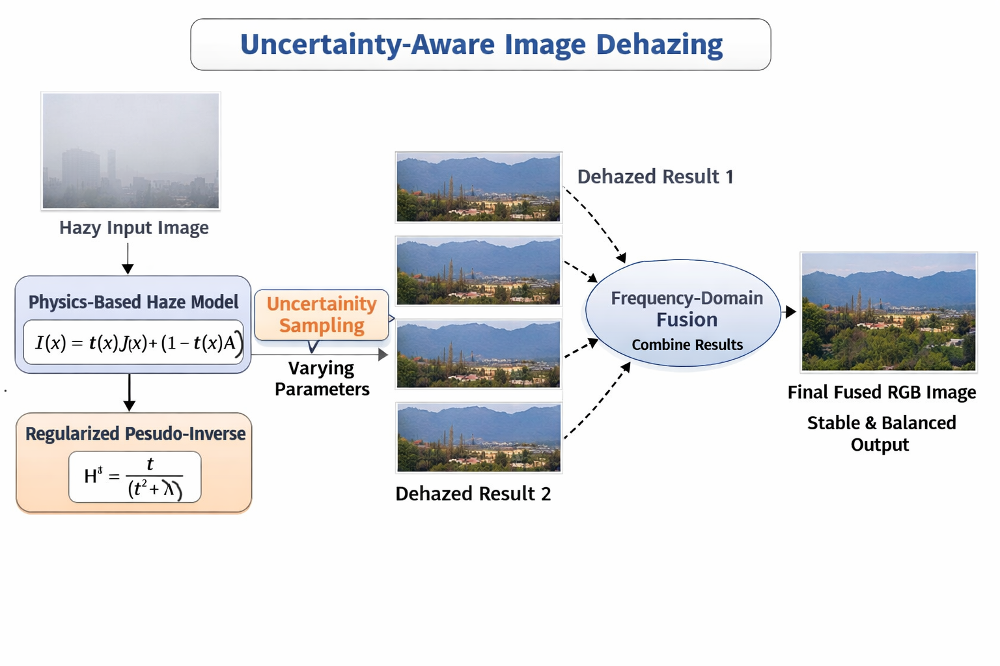

# D6_MFC4_ImageDehazing

This repository contains the MFC-4 course project implementation and documentation.

---

## Project Title

**Uncertainty-Aware Image Dehazing Using Pseudo-Inverse Modeling Inspired by CVAE**

---

## Team Details

**Team D – 6**

- Sai Jagruth – CB.SC.U4AIE24310  
- Baby Sree – CB.SC.U4AIE24318
- Vardhan – CB.SC.U4AIE24320
- Likitha Reddy – CB.SC.U4AIE24361

---

## Objective

The objective of this project is to develop a **single image dehazing method** that is:
- Uncertainty-aware
- Physically interpretable
- Free from training or large datasets

The goal is to generate a **stable and visually balanced dehazed RGB image** by modeling uncertainty in the haze inversion process.

---

## Motivation / Why This Project Is Interesting

Most modern dehazing methods rely on **deep learning models** that require large datasets and training, and often behave as black boxes.

This project is motivated by the idea that:
- Image dehazing is an **ill-posed inverse problem**
- A single hazy image can have **multiple valid dehazed solutions**
- Uncertainty should be **modeled explicitly**, not ignored

Inspired by CVAE-based uncertainty modeling, we explore how similar ideas can be applied **without learning**, using **physics-based models and inverse problem theory**.

---

## Project Description

This project focuses on **single image dehazing** using an **uncertainty-aware approach** inspired by Conditional Variational Autoencoders (CVAE).  
Unlike deep learning based methods, this approach **does not involve training or datasets**.

Instead of producing only one dehazed image, the method generates **multiple plausible dehazed outputs** by slightly varying the parameters of the physical haze inversion model. These outputs represent uncertainty in the dehazing process. The results are then **fused** to obtain a stable and visually balanced final RGB image.

The method is built using a **physics-based haze imaging model** and a **regularized pseudo-inverse formulation**.

---

## Methodology

### 1. Physical Haze Imaging Model

The atmospheric scattering model is used:

\[
I(x) = t(x) J(x) + (1 - t(x)) A
\]

where:
- \(I(x)\) is the observed hazy image  
- \(J(x)\) is the clean image  
- \(t(x)\) is the transmission map  
- \(A\) is the atmospheric light (airlight)

---

### 2. Inverse Problem Formulation

Subtracting airlight:

\[
I - A = t(x) (J - A)
\]

This is written as a linear inverse problem:

\[
I - A = H (J - A), \quad H = t(x)
\]

Direct inversion \(H^{-1} = 1/t\) is unstable when transmission is small.

---

### 3. Regularized Pseudo-Inverse

Using Tikhonov regularization, the stable pseudo-inverse is:

\[
H^\dagger = \frac{H}{H^2 + \lambda} = \frac{t}{t^2 + \lambda}
\]

This prevents noise amplification and brightness explosion in dense haze regions.

---

### 4. CVAE-Inspired Uncertainty Modeling

Instead of training a CVAE, uncertainty is modeled by:
- Varying transmission blur scales
- Varying regularization parameters \( \lambda \)

Each parameter set produces a **plausible dehazed image**, forming a one-to-many mapping similar to CVAE outputs.

---

### 5. Toy Example (Conceptual)

If a single hazy pixel has uncertain transmission values \(t_1, t_2, t_3\), then:

\[
J_k = \frac{t_k}{t_k^2 + \lambda}(I - A) + A
\]

This produces multiple valid reconstructions \(J_1, J_2, J_3\), which are later fused.

---

### 6. Fusion Strategy

The multiple dehazed outputs are fused in the **frequency domain**:

- Low-frequency components remain consistent
- High-frequency artifacts vary across samples

Frequency-domain fusion preserves structure and suppresses inconsistent artifacts better than spatial averaging.

---

### 7. Color Correction

Final RGB balancing is applied using a gray-world based scaling to maintain color consistency.

---

## Results & Discussion

- The method produces stable dehazed outputs for thin and moderate haze.
- Multiple reconstructions help reduce artifacts caused by incorrect parameter selection.
- Thick haze remains challenging due to severe information loss, but regularization improves stability.
- The approach is fully explainable and physically grounded.

---

## Challenges / Issues Faced

- Direct inversion caused over-brightness and color distortion.
- Thick haze leads to significant information loss.
- Single parameter settings failed across all haze conditions.
- Balancing enhancement without artifacts required careful tuning.

---

## Future Plans

- Improve transmission estimation using multi-scale techniques.
- Extend the approach to thin cloud removal in remote sensing images.
- Add quantitative evaluation metrics such as PSNR and SSIM.
- Explore hybrid approaches combining physics and lightweight learning.

---

## References

1. H. Ding et al., *Robust Haze and Thin Cloud Removal via Conditional Variational Autoencoders*, IEEE TGRS, 2024.  
   https://ieeexplore.ieee.org/document/10394023  

2. S. G. Narasimhan and S. K. Nayar, *Vision and the Atmosphere*, IJCV, 2002.  
   https://link.springer.com/article/10.1023/A:1016328200723  

3. A. N. Tikhonov and V. Y. Arsenin, *Solutions of Ill-Posed Problems*, 1977.  
   https://onlinelibrary.wiley.com/doi/book/10.1002/9780470172799  

---

## Content and Folder Structure

