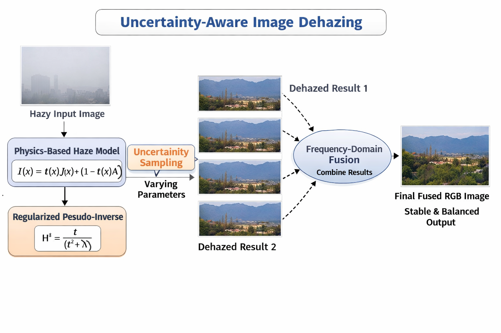

# D6_MFC4_ImageDehazing

This repository contains the MFC-4 course project implementation and documentation.

---

## Project Title

**Uncertainty-Aware Image Dehazing Using Pseudo-Inverse Modeling Inspired by CVAE**

---

## Team Details

**Team D – 6**

| Name        | Roll No            | Course Name | Program |
|-------------|-------------------|------------|---------|
| Sai Jagruth | CB.SC.U4AIE24310  | MFC        | AIE     |
| Baby Sree   | CB.SC.U4AIE24318  | MFC        | AIE     |
| Vardhan     | CB.SC.U4AIE24320  | MFC        | AIE     |
| Likitha Reddy | CB.SC.U4AIE24361 | MFC        | AIE     |

---

## Abstract

In this project, we worked on the problem of removing haze from a single image using a method that does not require any training data. Image dehazing is difficult because the same hazy image can have multiple possible clear versions. To handle this, we used a physics-based model and a regularized pseudo-inverse approach to reconstruct the image in a stable way. Instead of generating only one output, we created multiple dehazed images by slightly changing parameters to represent uncertainty, similar to the idea used in CVAE. These outputs are then combined using frequency domain fusion to get a final balanced image. The results show that our method improves visibility, restores details, and produces more natural colors, especially for thin and moderate haze conditions.

## Introduction

Images captured in outdoor environments often get affected by haze, fog, or dust. These particles scatter light and reduce the quality of the image. Because of this, images lose contrast, details become unclear, and colors look faded. This becomes a problem in applications like autonomous driving, surveillance, and object detection where clear images are important.

The main challenge in image dehazing is that it is an ill-posed problem. From a single hazy image, it is not easy to accurately estimate important factors like transmission, atmospheric light, and scene depth. Traditional methods like histogram equalization only improve contrast but do not actually solve the haze problem properly. Even direct inversion of the physical model can fail when transmission values are very low, causing noise and unwanted artifacts.

In this project, we tried to solve this problem using a different approach. Instead of using deep learning models that require large datasets, we focused on a physics-based solution. We used a regularized pseudo-inverse method to make the reconstruction stable. Also, instead of depending on a single output, we generated multiple possible dehazed images by varying parameters. This helps in capturing uncertainty in the process. Finally, all these outputs are combined using frequency domain fusion to produce a clear and stable image.

## Objective

The objective of this project is to develop a **single image dehazing method** that is:
- Uncertainty-aware
- Free from training unlike CVAE

The goal is to generate a **stable and visually balanced dehazed RGB image** by modeling uncertainty in the haze inversion process.

---

## Project Description

This project focuses on **single image dehazing** using an **uncertainty-aware approach** inspired by Conditional Variational Autoencoders (CVAE).  
Unlike deep learning based methods, this approach **does not involve training or datasets**.

Instead of producing only one dehazed image, the method generates **multiple plausible dehazed outputs** by slightly varying the parameters of the physical haze inversion model. These outputs represent uncertainty in the dehazing process. The results are then **fused** to obtain a stable and visually balanced final RGB image.

The method is built using a **physics-based haze imaging model** and a **regularized pseudo-inverse formulation**.

---

## Methodology

### 1. Physical Haze Imaging Model

The atmospheric scattering model is used:

I(x) = t(x) * J(x) + (1 - t(x)) * A

where:
- \(I(x)\) is the observed hazy image  
- \(J(x)\) is the clean image  
- \(t(x)\) is the transmission map  
- \(A\) is the atmospheric light (airlight)

---

### 2. Inverse Problem Formulation

Subtracting airlight:

I(x) - A = t(x) * (J(x) - A)

This is written as a linear inverse problem:

I - A = H * (J - A)

where: H = t(x)

Direct inversion H⁻¹ = 1 / t is unstable when transmission is small.

---

### 3. Regularized Pseudo-Inverse

Using Tikhonov regularization, the stable pseudo-inverse is:

H† = H / (H² + λ)

Substituting H = t(x):

H† = t / (t² + λ)

This prevents noise amplification and brightness explosion in dense haze regions.

---

### 4. CVAE-Inspired Uncertainty Modeling

Instead of training a CVAE, uncertainty is modeled by:
- Varying transmission blur scales
- Varying regularization parameters \( \lambda \)

Each parameter set produces a **plausible dehazed image**, forming a one-to-many mapping similar to CVAE outputs.

---

### 5. Toy Example (Conceptual)

If a single hazy pixel has uncertain transmission values \(t1, t2, t3\), then:

Jk = (tk / (tk² + λ)) * (I - A) + A

This produces multiple valid reconstructions \(J1, J2, J3\), which are later fused.

---

### 6. Fusion Strategy

The multiple dehazed outputs are fused in the **frequency domain**:

- Low-frequency components remain consistent
- High-frequency artifacts vary across samples

Frequency-domain fusion preserves structure and suppresses inconsistent artifacts better than spatial averaging.

---

### 7. Color Correction

Final RGB balancing is applied using a gray-world based scaling to maintain color consistency.

---

## Results & Discussion

- The method produces stable dehazed outputs for thin and moderate haze.
- Multiple reconstructions help reduce artifacts caused by incorrect parameter selection.
- Thick haze remains challenging due to severe information loss.

---

## Challenges / Issues Faced

- Direct inversion caused over-brightness and color distortion.
- Thick haze leads to significant information loss.
- Single parameter settings failed across all haze conditions.
- Balancing enhancement without artifacts required careful tuning.

---

## Future Plans

- Improve transmission estimation using multi-scale techniques.
- Adaptive handling for **thin, moderate, and thick haze** conditions.

---

## References

1. H. Ding et al., *Robust Haze and Thin Cloud Removal via Conditional Variational Autoencoders*, IEEE TGRS, 2024.  
   https://ieeexplore.ieee.org/document/10394023  

2. K. He, J. Sun and X. Tang, "Single Image Haze Removal Using Dark Channel Prior," in IEEE Transactions on Pattern Analysis and Machine Intelligence 
   https://ieeexplore.ieee.org/document/5567108

---

