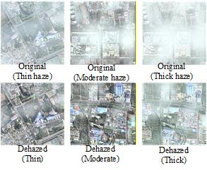
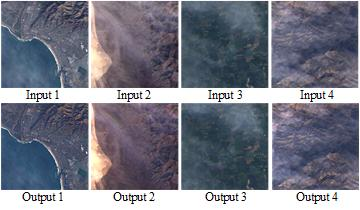
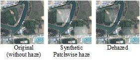

# D6_MFC4_ImageDehazing

## Mathematics for Computing 4 – Project
Amrita School of Artificial Intelligence  
Amrita Vishwa Vidyapeetham – Coimbatore

This repository contains the MFC-4 course project implementation and documentation.

---

## Project Title

**Uncertainty-Aware Image Dehazing Using Pseudo-Inverse Modeling Inspired by CVAE**

---

## Team Details

**Team D – 6**

| Name        | Roll No            | Course Name | Program |
|-------------|-------------------|------------|---------|
| Sai Jagruth | CB.SC.U4AIE24310  | MFC        | AIE     |
| Baby Sree   | CB.SC.U4AIE24318  | MFC        | AIE     |
| Vardhan     | CB.SC.U4AIE24320  | MFC        | AIE     |
| Likitha Reddy | CB.SC.U4AIE24361 | MFC        | AIE     |

---

## Abstract

In this project, we worked on the problem of removing haze from a single image using a method that does not require any training data. Image dehazing is difficult because the same hazy image can have multiple possible clear versions. To handle this, we used a physics-based model and a regularized pseudo-inverse approach to reconstruct the image in a stable way. Instead of generating only one output, we created multiple dehazed images by slightly changing parameters to represent uncertainty, similar to the idea used in CVAE. These outputs are then combined using frequency domain fusion to get a final balanced image. The results show that our method improves visibility, restores details, and produces more natural colors, especially for thin and moderate haze conditions.

## Introduction

Images captured in outdoor environments often get affected by haze, fog, or dust. These particles scatter light and reduce the quality of the image. Because of this, images lose contrast, details become unclear, and colors look faded. This becomes a problem in applications like autonomous driving, surveillance, and object detection where clear images are important.

The main challenge in image dehazing is that it is an ill-posed problem. From a single hazy image, it is not easy to accurately estimate important factors like transmission, atmospheric light, and scene depth. Traditional methods like histogram equalization only improve contrast but do not actually solve the haze problem properly. Even direct inversion of the physical model can fail when transmission values are very low, causing noise and unwanted artifacts.

In this project, we tried to solve this problem using a different approach. Instead of using deep learning models that require large datasets, we focused on a physics-based solution. We used a regularized pseudo-inverse method to make the reconstruction stable. Also, instead of depending on a single output, we generated multiple possible dehazed images by varying parameters. This helps in capturing uncertainty in the process. Finally, all these outputs are combined using frequency domain fusion to produce a clear and stable image.

# Difference Between Haze, Blur and Noise

| Degradation | Cause | Effect |
|-------------|------|--------|
| Haze | Atmospheric scattering | Reduced contrast |
| Blur | Motion or defocus | Loss of sharpness |
| Noise | Sensor disturbance | Random pixel variations |

Haze is **depth dependent**, unlike blur or noise.

---

# Atmospheric Scattering Model

The formation of hazy images follows:

I(x) = J(x)t(x) + A(1 − t(x))

Where:

I(x) → observed hazy image  
J(x) → clean scene radiance  
t(x) → transmission map  
A → atmospheric light  

Transmission is defined as:

t(x) = exp(-β d(x))

where:

d(x) → scene depth  
β → scattering coefficient

---

# Scene Radiance Recovery

Rearranging the haze model:

J(x) = (I(x) − A(1 − t(x))) / t(x)

However, direct inversion becomes unstable when transmission is small.

---

# Regularized Pseudo-Inverse Reconstruction

To stabilize the inversion:

H = t(x)

Direct inverse:

H⁻¹ = 1/t

Using Tikhonov regularization:

H† = H / (H² + λ)

Substituting H = t:

H† = t / (t² + λ)

Reconstruction:

J = H†(I − A) + A

---

# Uncertainty-Aware Reconstruction

Instead of producing a single solution, multiple reconstructions are generated:

J1, J2, J3, J4

Each uses different:

- blur sizes
- regularization parameters

This models uncertainty similar to CVAE approaches.

---

# Frequency Domain Fusion

Each reconstructed image is transformed using Fourier transform.

F(u,v) = Σ Σ f(x,y)e^{-j2π(ux/M + vy/N)}

The spectra are averaged:

F_fused = (1/N) Σ F(Jk)

Final image is recovered using inverse Fourier transform.

---

# Results

*Figure: Dehazed image produced by the proposed method with 3 different types of haze.*

*Figure: Dehazed image produced by the proposed method in different regions.*

# Patch-wise Haze Modeling

Real haze varies spatially. To simulate this:

Two rectangular patches are selected.

Distance from patch center:

d(x,y) = sqrt((x-xc)^2 + (y-yc)^2)

Normalized distance:

dn(x,y) = d(x,y)/max(d(x,y))

Transmission inside patch:

tp(x,y) = 0.4 + 0.3 dn(x,y)

---

# Patch-Selective Dehazing

A haze mask identifies haze regions.

M(x,y) = 1 if t(x,y) < τ else 0

Final reconstruction:

J_final = M * J_global + (1-M) * I

This prevents modifying already clear regions.

---

*Figure: Dehazed image produced by the proposed method with patchwise haziness.*

# ADMM Formulation

The dehazing problem can be expressed as:

min_J || I − (Jt + A(1 − t)) ||² + λ R(J)

Using ADMM:

J^(k+1) = argmin ||I − (Jt + A(1 − t))||² + (ρ/2)||J − Z + U||²

ADMM improves numerical stability and prevents over-amplification.

---

# Frobenius Norm Evaluation

Image energy is measured using:

||I||_F = sqrt(Σ I²)

||J||_F = sqrt(Σ J²)

Haze removed:

||I − J||_F

Haze reduction percentage:

(||I − J||_F / ||I||_F) × 100

---

| Type | Input Frobenius Norm | Output Frobenius Norm |
|-----|-----|-----|
| Thin Haze | 672.7853 | 564.9371 |
| Moderate Haze | 680.6378 | 573.6836 |
| Thick Haze | 799.4276 | 717.0184 |
| Patch-wise Haze | 474.7369 | 444.4685 |

# Frobenius Norm and Singular Values

If I = UΣVᵀ then

||I||_F = sqrt(Σ σ_i²)

Thus Frobenius norm equals the energy of singular values.

---

# Results

The proposed framework improves:

- visibility
- edge clarity
- contrast
- color consistency

The method works effectively across different scenes such as mountains, urban environments, vegetation, and water bodies.

---

# Details
platform used : laptop
hardware : cpu 
time taken for uniform haziness removal : 7.874679 seconds
time taken for patchwise haziness removal : 3.011576 seconds
Matlab

# Conclusion

In this project, we developed a method for single image dehazing using a combination of physical modeling and signal processing techniques. The atmospheric scattering model was used to represent how haze affects an image. To recover the clear image, we used a regularized pseudo-inverse approach, which helps avoid instability during inversion.

To improve the results, we generated multiple dehazed images by changing parameters like transmission smoothing and regularization. This helped in handling uncertainty and avoided relying on a single reconstruction. These multiple outputs were then combined using frequency-domain fusion, which helped preserve important details while reducing noise and artifacts.

We also applied contrast enhancement and color correction to improve the final output. The results show that the method works well for different haze conditions and improves both visibility and image quality. Overall, this approach provides a simple and effective solution for image dehazing without using any training data.

The framework produces stable and visually improved dehazing results.

---

## References

1. H. Ding et al., *Robust Haze and Thin Cloud Removal via Conditional Variational Autoencoders*, IEEE TGRS, 2024.  
   https://ieeexplore.ieee.org/document/10394023  

2. K. He, J. Sun and X. Tang, "Single Image Haze Removal Using Dark Channel Prior," in IEEE Transactions on Pattern Analysis and Machine Intelligence 
   https://ieeexplore.ieee.org/document/5567108

---
